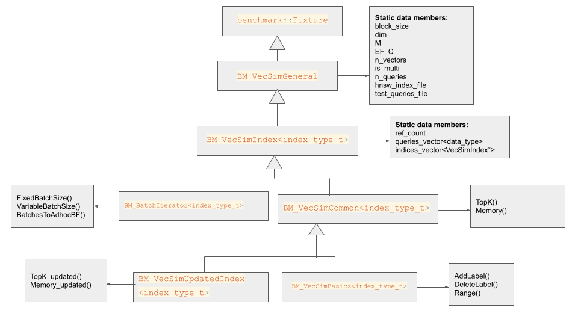

# Vector Similarity benchmarks for developers

## Table of contents

* [Directory structure](#directory-structure)
    - [How to define and register a new test](#how-to-define-and-register-a-new-test)
* [Fixtures](#fixtures)
    - [Benchmarks fixture classes hierarchy](#benchmarks-fixture-classes-hierarchy)

# Directory structure 
The benchmark directory contains several types of files as follows:
* **Header** files with the classes that are used to define the benchmark test routines. See [Fixtures](#fixtures) section for details.   
It also includes `bm_definitions.h` header that contains benchmarks utils such as:
    - `IndexType` struct
    - common typedefs
    - macro shortcuts to the static data members of `BM_VecSimGeneral` and `BM_VecSim_Index<index_type_t>`
* **subdirectory bm_initialization** - Each file is associated with a test set (basics/batch etc) of a particular **data type**, and fits for both single and multi indices. Here we define and register the tests using Google benchmarks macros.  See [How to define and register a new test](#how-to-define-and-register-a-new-test) section.
* **subdirectory run_files** - contains a file for each combination of: set of benchmark tests, index data type, and index type(single/multi).  
In this file we:
    - Initialize `BM_VecSimGeneral` required data members according to the set of parameters of the index loaded from the relevant serialized index file.
    - In addition, the macro `BM_FUNC_NAME(bm_func, algo)` is defined to be used in the initialization file, to define a **unique** name for the benchmark test (see [Tests naming](#tests-naming)).
    - Include the initialization file from `bm_initialization` subdirectory that calls google benchmark definitions and registrations macros.
    - Call `BENCHMARK_MAIN()` 


## How to define and register a new test
Google benchmarks library supports templated fixtures (see [Google benchmarks user guide](https://github.com/google/benchmark/blob/main/docs/user_guide.md#templated-benchmarks) regarding this topic).  

### Definition:  
`BENCHMARK_TEMPLATE_DEFINE_F(fixture_name, test_name, data_type)(benchmark::State &st){fixture_name::test_implementation(st, test_args);}`   
fixture_name::test_implementation() should be defined in the fixture class that implements the required test case.
### Registration
`BENCHMARK_REGISTER_F(test_fixture, test_name)->Args({val1, val2})->ArgNames({"name1", "name2"})->Iterations(val0)->Unit(benchmark::kMillisecond)`  
Here we register to the benchmarks running loop the test that was bound to `test_fixture` and has `test_name`.  
*NOTE:* The **registration order** is important. Changing it might violate the ability to compare one benchmark run to another. We have tests (such as addLabel and DeleteLabel) that modify the indices and are not idempotent.
# Fixtures
## Fixture template type
Since the Google benchmarks library supports fixtures with only one template argument, we use a helper struct to define multiple types.  
```c++
// benchmarks/bm_definitions.h
template <VecSimType type, typename DataType, typename DistType = DataType>
struct IndexType {

    static VecSimType get_index_type() { return type; }

    typedef DataType data_t;
    typedef DistType dist_t;
};

// benchmarks/bm_vecsim_index.h
template <typename index_type_t>
class BM_VecSimIndex : public BM_VecSimGeneral {
    
    // Parsing the struct's types
    using data_t = typename index_type_t::data_t;
    using dist_t = typename index_type_t::dist_t;
    ...
    static std::vector<std::vector<data_t>> queries;

    // Using the VecSimType getter 
    static void Initialize() {
        VecSimType type = index_type_t::get_index_type();
        ...
    }
};

```
## Benchmarks fixture classes hierarchy 

<p align="center">
   
</p>

### class BM_VecSimGeneral
Defined in bm_vecsim_general.h  
This class inherits from benchmark::Fixture.  
It includes the index parameters as static data members. The static data members are initialized in the .cpp files under benchmark/run_files.  
To refer a member from one of the derived classes, BM_VecSimGeneral:: must be used. Shortcut macros such as `#define N_QUERIES BM_VecSimGeneral::n_queries` are available in bm_definitions.h.
### class BM_VecSim_Index
Defined in bm_vecsim_index.h  
This class's purpose is to initialize the indices' and queries' lists data.
It contains:
* A list `indices` of `VecSimIndex *` type. One can refer to an index using `VecSimAlgo` enum, where `VecSimAlgo = VecSimAlgo_BF = 0` and `VecSimAlgo = VecSimAlgo_HNSWLIB = 1`.   
In the initialization function, we load HNSW index data from a file and insert the same vectors to the flat index under the same labels.
*NOTE:* In the updated tests set we use this list to save the four indices described [above](#bm_vecsimupdatedindex), where `indices[0]` and `indices[1]` are the flat and HNSW **before** the update, respectively, and `indices[2]` and `indices[3]` are the flat and HNSW **after** the update, respectively.
* A list `queries`, contains the query vectors of `data_t` type.  
Both lists are populated using the files defined in `BM_VecSimGeneral`.
* Reference count - each benchmark definitions instantiate a new object of the `test_fixture`. Loading the indices and storing them in every single instance might take time and memory. To avoid calling the initialization function multiple times, we use the reference count in the constructor- if it's 0 we initialize the lists mentioned above, otherwise we just increase the reference count.  
We also make sure we don't free the indices before we finished all the set's tests - in the class destructor we decrease the reference count, and if it has reached 0 - we free the indices.
### Remarks
* `indices` and `queries` lists need to be explicitly initialized for a specific type. For example:
```c++
template <>
std::vector<std::vector<float>> BM_VecSimIndex<fp32_index_t>::queries{};

template <>
std::vector<VecSimIndex *> BM_VecSimIndex<fp32_index_t>::indices{};
```
### class BM_VecSimCommon
Defined in bm_common.h  
In this class we define the test routines  which are common between the **basics** benchmark and the [**updated index**](#bm_vecsimupdatedindex) benchmarks:
* `TopK_BF`
* `TopK_HNSW`
* `Memory_FLAT` 
* `Memory_HNSW`  
### Remarks
These functions have `index_offset` parameter (defaults to 0) to be used when we want to apply the function on an updated index.  
In addition, in this file, we define macros with the arguments for the `TopK` registration.

### class BM_VecSimBasics
Defined in bm_vecsim_basics.h  
In this class we define additional tests for the basic tests set:
* `AddLabel` - Add one label per iteration (meaning one vector for single value index, and multiple vectors for multi-value index)
* `DeleteLabel<algo_t>` - Delete one label per iteration (meaning 1 vector for single value index, and multiple vector for multi value index).  
`algo_t` is the specific index type that is required to obtain vector data by its label (used to restore the deleted vectors). This requirement for the `algo_t` parameter is the reason that this test case is defined separately in each .cpp file using `DEFINE_DELETE_LABEL` macro (defined in bm_vecsim_basics.h). The registration is done like all other test cases in the initialization file.  
* `Range_BF` 
* `Range_HNSW`  
In addition, in this file, we define macros with the arguments for the `Range`, `AddLabel`, and `DeleteLabel` registration.
### Remarks
The [basic benchmark set](#bm_vecsimbasics) includes functions defined both in `BM_VecSimCommon` and `BM_VecSimBasics`. Pay attention to refer the correct class when defining the test in the [initialization file](#how-to-define-and-register-a-new-test).
### class BM_VecSimUpdatedIndex
Defined in bm_updated_index.h  
In this class constructor, we add the additional indices, the "updated" indices. The "before" indices are initialized in `BM_VecSimIndex`.  
This class defines no new test routines and uses only tests defined in `BM_VecSimCommon`.  

### class BM_BatchIterator
Defined in bm_batch_iterator.h  
Here we implement the tests routines of [batch iterator set](#bm_batchiterator) to be called by the test definition in the [initialization file](#how-to-define-and-register-a-new-test).  
In this file, we also define the arguments for each test case in the batch iterator tests set.

### Tests naming:
A test name will have the following format: 
`test_fixture<fixture_data_type>/test_name/arg1:val/iterations:val`  
for example:  
`BM_VecSimBasics<fp32_index_t>/Range_HNSW_Single/radiusX100:20/epsilonX1000:1/iterations:10`  
The test's name components are:
1. The test's fixture and the fixture type (if it's templated)
2. The name as given in definition and registration
3. arguments names and values  
*NOTE:* the fixture type (fp32_index_t, for example) is part of the name, so tests that use a different fixture **or** the same fixture of a different type, **can** share the same name.  

## benchmarks.sh [ BM_TYPE ]
This script expects to get zero or one argument.  
It will print the names of the benchmarks binary files, **without** the `bm_` prefix, separated by `\n`.  
You can run this script with no argument (or `BM_TYPE = benchmarks-all`) to refer to **all** available benchmarks, or specify a set of benchmark tests.  


