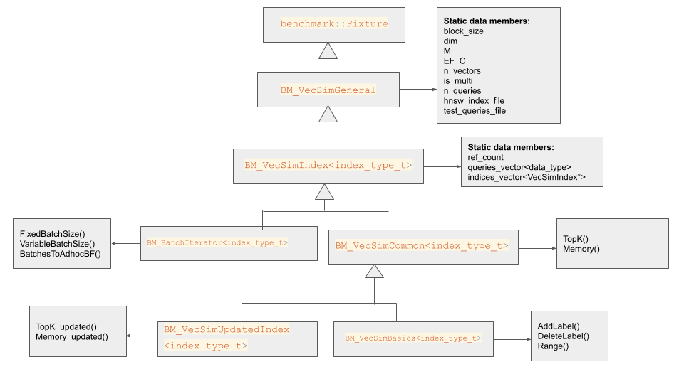

# Vector Similarity benchmarks

## Table of contents
* [Overview](#overview)
* [Run benchmarks](#run-benchmarks)
* [Available sets](#available-sets)  
    - [BM_VecSimBasics](#bm_vecsimbasics)  
    - [BM_BatchIterator](#bm_batchiterator)  
    - [BM_VecSimUpdatedIndex](#bm_vecsimupdatedindex)  
* [Directory structure](#directory-structure)
    - [How to define and register a new test](#how-to-define-and-register-a-new-test)
* [Fixtures](#fixtures)
    - [Benchmarks fixture classes hierarchy](#benchmarks-fixture-classes-hierarchy)
* [Cmake remarks](#cmake-remarks)
* [ann-benchmarks](#ann-benchmark)

# Overview
We use the [Google benchmark](https://github.com/google/benchmark) tool to run micro-benchmarks for the vector indexes functionality.  
Google benchmark is a popular tool for benchmark code snippets, similar to unit tests. It allows a quick way to estimate the runtime of each use case based on several (identical) runs, and prints the results as output. For some tests, the output includes an additional "Recall" metric, which indicates the accuracy in the case of approximate search.  
**The recall** is calculated as the size of the intersection set between the number of the ground truth results (calculated by the flat algorithm) and the returned results from the approximate algorithm (HNSW in this case), divided by the number of ground truth results:  
$$ recall = \frac{\text{approximate algorithm results } \cap
\text{ ground truth results } } {\text{ground truth results}}
$$
# Run benchmarks
## Required files
The serialized indices files that are used for micro-benchmarking and running ann-benchmark can be found in
`tests/benchmark/data/hnsw_indices.txt`.  
To download all the required files, run from the repository root directory:
```sh
wget -q -i tests/benchmark/data/hnsw_indices.txt -P tests/benchmark/data
```
To run all test sets, call the following commands from the project root dir:
```sh
make benchmark
```
### Running a Subset of Benchmarks
To run only a subset of benchmarks that match a specified `<regex>`, set `BENCHMARK_FILTER=<regex>` environment variable. For example:  
```sh
make benchmark BENCHMARK_FILTER=fp32*
```

# Available sets
There are currently 3 sets of benchmarks available: `BM_VecSimBasics`, `BM_BatchIterator`, and `BM_VecSimUpdatedIndex`. Each is templated according to the index data type. We run 10 iterations of each test case, unless otherwise specified.
## BM_VecSimBasics
For each combination of data type (fp32/fp64) and index type (single/multi) the following test cases are included:
1. Mesure index total `memory` (runtime and iterations number are irrelevant for this use case, just the memory metric) 
2. `AddLabel` - runs for `DEFAULT_BLOCK_SIZE (= 1024)` iterations, in each we add one new label to the index from the `queries` list. Note that for a single value index each label contains one vector, meaning that the number of new labels equals the number of new vectors.  
**results:** average time per label, average memory addition per vector, vectors per label.  
*At the end of the benchmark, we delete the added labels*
3. `DeleteLabel` - runs for `DEFAULT_BLOCK_SIZE (= 1024)` iterations, in each we delete one label from the index. Note that for a single value index each label contains one vector, meaning that the number of deleted labels equals the number of deleted vectors.  
**results:** average time per label, average memory addition per vector (a negative value means that the memory has decreased).  
*At the end of the benchmark, we restore the deleted vectors under the same labels*
#### **TopK benchmarks**
Search for the `k` nearest neighbors of the query.   
4. Run `Top_K` query over the flat index (using brute-force search), for each `k=10`, `k=100` and `k=500`  
**results:** average time per iteration  
5. Run `Top_K` query over the HNSW index, for each pair of `{ef_runtime, k}` from the following:  
    `{ef_runtime=10, k=10}`   
    `{ef_runtime=200, k=10}`   
    `{ef_runtime=100, k=100}`   
    `{ef_runtime=200, k=100}`   
    `{ef_runtime=500, k=500}`   
**results:** average time per iteration, recall  
#### **Range query benchmarks**
In range query, we search for all the vectors in the index whose distance to the query vector is lower than the range.  
6. Run `Range` query over the flat index (using brute-force search), for each `radius=0.2`, `radius=0.35` and `radius=0.5`  
**results:** average time per iteration, average results number per iteration  
7. Run `Range` query over the HNSW index, for each pair of `{radius, epsilon}` from the following:  
    `{radius=0.2, epsilon=0.001}`   
    `{radius=0.2, epsilon=0.01}`    
    `{radius=0.2, epsilon=0.1}`     
    `{radius=0.35, epsilon=0.001}`   
    `{radius=0.35, epsilon=0.01}`      
    `{radius=0.35, epsilon=0.1}`      
    `{radius=0.5, epsilon=0.001}`   
    `{radius=0.5, epsilon=0.01}`   
    `{radius=0.5, epsilon=0.1}`   
**results:** average time per iteration, average results number per iteration, recall  

## BM_BatchIterator
The purpose of these tests is to benchmark batch iterator functionality. The batch iterator is a handle that enables running `Top_K` query in batches, by asking for the next best `n` results repeatedly, until there are no more results to return. We use for this test cases the same indices that were built for the "basic benchmark" for this test case as well.  
The test cases are:
1. Fixed batch size - Run `Top_K` query for each pair of `{batch size, number of batches}` from the following:  
`{batch size=10, number of batches=1}`  
`{batch size=10, number of batches=3}`  
`{batch size=10, number of batches=5}`  
`{batch size=100, number of batches=1}`  
`{batch size=100, number of batches=3}`  
`{batch size=100, number of batches=5}`  
`{batch size=1000, number of batches=1}`  
`{batch size=1000, number of batches=3}`  
`{batch size=1000, number of batches=5}`  
**Flat index results:** Time per iteration, memory delta per iteration
**HNSW index results:** Time per iteration,  Recall, memory delta per iteration
2. Variable batch size - Run `Top_K` query where in each iteration the batch size is increased by a factor of 2, for each pair of `{batch initial size, number of batches}` from the following:  
`{batch initial size=10, number of batches=2}`  
`{batch initial size=10, number of batches=4}`  
`{batch initial size=100, number of batches=2}`  
`{batch initial size=100, number of batches=4}`  
`{batch initial size=1000, number of batches=2}`  
`{batch initial size=1000, number of batches=4}`  
**Flat index results:** Time per iteration
**HNSW index results:** Time per iteration, Recall, memory delta per iteration
3. Batches to Adhoc BF - In each iteration we run `Top_K` with an increasing `batch size` (initial size=10, increase factor=2) for `number of batches` and then switch to ad-hoc BF. We define `step` as the ratio between the index size to the number of vectors to go over in ad-hoc BF. The tests run for each pair of `{step, number of batches}` from the following:  
`{step=5, number of batches=0}`  
`{step=5, number of batches=2}`  
`{step=5, number of batches=5}`  
`{step=10, number of batches=0}`  
`{step=10, number of batches=2}`  
`{step=10, number of batches=5}`  
`{step=20, number of batches=0}`  
`{step=20, number of batches=2}`  
`{step=20, number of batches=5}`  
**Flat index results:** Time per iteration
**HNSW index results:** Time per iteration, memory delta per iteration

## BM_VecSimUpdatedIndex
For this use case, we create two indices for each algorithm (flat and HNSW). The first index contains 500K vectors added to an empty index. The other index also contains 500K vectors, but this time they were added by overriding the 500K vectors of the aforementioned indices. Currently, we only test this for FP32 single-value index.  
The test cases are:
1. Index `total memory` **before** updating
2. Index `total memory` **after** updating
3. Run `Top_K` query over the flat index **before** updating (using brute-force search), for each `k=10`, `k=100` and `k=500`  
**results:** average time per iteration
4. Run `Top_K` query over the flat index **after** updating (using brute-force search), for each `k=10`, `k=100` and `k=500`  
**results:** average time per iteration
5. Run **100** iterations of `Top_K` query over the HNSW index **before** updating, for each pair of `{ef_runtime, k}` from the following:  
    `{ef_runtime=10, k=10}`   
    `{ef_runtime=200, k=10}`   
    `{ef_runtime=100, k=100}`   
    `{ef_runtime=200, k=100}`   
    `{ef_runtime=500, k=500}`   
**results:** average time per iteration, recall
6. Run **100** iterations of `Top_K` query over the HNSW index **after** updating, for each pair of `{ef_runtime, k}` from the following: 
    `{ef_runtime=10, k=10}`   
    `{ef_runtime=200, k=10}`   
    `{ef_runtime=100, k=100}`   
    `{ef_runtime=200, k=100}`   
    `{ef_runtime=500, k=500}`   
**results:** average time per iteration, recall  

# Directory structure 
The benchmark directory contains several types of files as follows:
* **Header** files with the classes that are used to define the benchmark test routines. See [Fixtures](#fixtures) section for details.   
It also includes `bm_definitions.h` header that contains benchmarks utils such as:
    - `IndexType` struct
    - common typedefs
    - macro shortcuts to the static data members of `BM_VecSimGeneral` and `BM_VecSim_Index<index_type_t>`
* **subdirectory bm_initialization** - Each file is associated with a test set (basics/batch etc) of a particular **data type**, and fits for both single and multi indices. Here we define and register the tests using Google benchmarks macros.  See [How to define and register a new test](#how-to-define-and-register-a-new-test) section.
* **subdirectory run_files** - contains a file for each combination of: set of benchmark tests, index data type, and index type(single/multi).  
In this file we:
    - Initialize `BM_VecSimGeneral` required data members according to the set of parameters of the index loaded from the relevant serialized index file.
    - In addition, the macro `BM_FUNC_NAME(bm_func, algo)` is defined to be used in the initialization file, to define a **unique** name for the benchmark test (see [Tests naming](#tests-naming)).
    - Include the initialization file from `bm_initialization` subdirectory that calls google benchmark definitions and registrations macros.
    - Call `BENCHMARK_MAIN()` 


## How to define and register a new test
Google benchmarks library supports templated fixtures (see [Google benchmarks user guide](https://github.com/google/benchmark/blob/main/docs/user_guide.md#templated-benchmarks) regarding this topic).  

### Definition:  
`BENCHMARK_TEMPLATE_DEFINE_F(fixture_name, test_name, data_type)(benchmark::State &st){fixture_name::test_implementation(st, test_args);}`   
fixture_name::test_implementation() should be defined in the fixture class that implements the required test case.
### Registration
`BENCHMARK_REGISTER_F(test_fixture, test_name)->Args({val1, val2})->ArgNames({"name1", "name2"})->Iterations(val0)->Unit(benchmark::kMillisecond)`  
Here we register to the benchmarks running loop the test that was bound to `test_fixture` and has `test_name`.  
*NOTE:* The **registration order** is important. Changing it might violate the ability to compare one benchmark run to another. We have tests (such as addLabel and DeleteLabel) that modify the indices and are not idempotent.
# Fixtures
## Fixture template type
Since the Google benchmarks library supports fixtures with only one template argument, we use a helper struct to define multiple types.  
```c++
// benchmarks/bm_definitions.h
template <VecSimType type, typename DataType, typename DistType = DataType>
struct IndexType {

    static VecSimType get_index_type() { return type; }

    typedef DataType data_t;
    typedef DistType dist_t;
};

// benchmarks/bm_vecsim_index.h
template <typename index_type_t>
class BM_VecSimIndex : public BM_VecSimGeneral {
    
    // Parsing the struct's types
    using data_t = typename index_type_t::data_t;
    using dist_t = typename index_type_t::dist_t;
    ...
    static std::vector<std::vector<data_t>> queries;

    // Using the VecSimType getter 
    static void Initialize() {
        VecSimType type = index_type_t::get_index_type();
        ...
    }
};

```
## Benchmarks fixture classes hierarchy 

<p align="center">
   
</p>

### class BM_VecSimGeneral
Defined in bm_vecsim_general.h  
This class inherits from benchmark::Fixture.  
It includes the index parameters as static data members. The static data members are initialized in the .cpp files under benchmark/run_files.  
To refer a member from one of the derived classes, BM_VecSimGeneral:: must be used. Shortcut macros such as `#define N_QUERIES BM_VecSimGeneral::n_queries` are available in bm_definitions.h.
### class BM_VecSim_Index
Defined in bm_vecsim_index.h  
This class's purpose is to initialize the indices' and queries' lists data.
It contains:
* A list `indices` of `VecSimIndex *` type. One can refer to an index using `VecSimAlgo` enum, where `VecSimAlgo = VecSimAlgo_BF = 0` and `VecSimAlgo = VecSimAlgo_HNSWLIB = 1`.   
In the initialization function, we load HNSW index data from a file and insert the same vectors to the flat index under the same labels.
*NOTE:* In the updated tests set we use this list to save the four indices described [above](#bm_vecsimupdatedindex), where `indices[0]` and `indices[1]` are the flat and HNSW **before** the update, respectively, and `indices[2]` and `indices[3]` are the flat and HNSW **after** the update, respectively.
* A list `queries`, contains the query vectors of `data_t` type.  
Both lists are populated using the files defined in `BM_VecSimGeneral`.
* Reference count - each benchmark definitions instantiate a new object of the `test_fixture`. Loading the indices and storing them in every single instance might take time and memory. To avoid calling the initialization function multiple times, we use the reference count in the constructor- if it's 0 we initialize the lists mentioned above, otherwise we just increase the reference count.  
We also make sure we don't free the indices before we finished all the set's tests - in the class destructor we decrease the reference count, and if it has reached 0 - we free the indices.
### Remarks
* `indices` and `queries` lists need to be explicitly initialized for a specific type. For example:
```c++
template <>
std::vector<std::vector<float>> BM_VecSimIndex<fp32_index_t>::queries{};

template <>
std::vector<VecSimIndex *> BM_VecSimIndex<fp32_index_t>::indices{};
```
### class BM_VecSimCommon
Defined in bm_common.h  
In this class we define the test routines  which are common between the **basics** benchmark and the [**updated index**](#bm_vecsimupdatedindex) benchmarks:
* `TopK_BF`
* `TopK_HNSW`
* `Memory_FLAT` 
* `Memory_HNSW`  
### Remarks
These functions have `index_offset` parameter (defaults to 0) to be used when we want to apply the function on an updated index.  
In addition, in this file, we define macros with the arguments for the `TopK` registration.

### class BM_VecSimBasics
Defined in bm_vecsim_basics.h  
In this class we define additional tests for the basic tests set:
* `AddLabel` - Add one label per iteration (meaning one vector for single value index, and multiple vectors for multi-value index)
* `DeleteLabel<algo_t>` - Delete one label per iteration (meaning 1 vector for single value index, and multiple vector for multi value index).  
`algo_t` is the specific index type that is required to obtain vector data by its label (used to restore the deleted vectors). This requirement for the `algo_t` parameter is the reason that this test case is defined separately in each .cpp file using `DEFINE_DELETE_LABEL` macro (defined in bm_vecsim_basics.h). The registration is done like all other test cases in the initialization file.  
* `Range_BF` 
* `Range_HNSW`  
In addition, in this file, we define macros with the arguments for the `Range`, `AddLabel`, and `DeleteLabel` registration.
### Remarks
The [basic benchmark set](#bm_vecsimbasics) includes functions defined both in `BM_VecSimCommon` and `BM_VecSimBasics`. Pay attention to refer the correct class when defining the test in the [initialization file](#how-to-define-and-register-a-new-test).
### class BM_VecSimUpdatedIndex
Defined in bm_updated_index.h  
In this class constructor, we add the additional indices, the "updated" indices. The "before" indices are initialized in `BM_VecSimIndex`.  
This class defines no new test routines and uses only tests defined in `BM_VecSimCommon`.  

### class BM_BatchIterator
Defined in bm_batch_iterator.h  
Here we implement the tests routines of [batch iterator set](#bm_batchiterator) to be called by the test definition in the [initialization file](#how-to-define-and-register-a-new-test).  
In this file, we also define the arguments for each test case in the batch iterator tests set.

### Tests naming:
A test name will have the following format: 
`test_fixture<fixture_data_type>/test_name/arg1:val/iterations:val`  
for example:  
`BM_VecSimBasics<fp32_index_t>/Range_HNSW_Single/radiusX100:20/epsilonX1000:1/iterations:10`  
The test's name components are:
1. The test's fixture and the fixture type (if it's templated)
2. The name as given in definition and registration
3. arguments names and values  
*NOTE:* the fixture type (fp32_index_t, for example) is part of the name, so tests that use a different fixture **or** the same fixture of a different type, **can** share the same name.  

## benchmarks.sh
In this file, we define the names of the benchmarks binary files, **without** the `bm_` prefix. The names are used in:
1. cmake of the benchmarks - given a `${benchmark}.cpp` file, create an executable file name `bm_${benchmark}`
2. Makefile - to execute the benchmarks and define the results files names `${benchmark}_results`.
3. benchmark.yml - read the results from the files according to the name defined in the Makefile.

# ANN-Benchmark

[ANN-Benchmarks](http://ann-benchmarks.com/) is a benchmarking environment for approximate nearest neighbor algorithms search (for additional information, refer to the project's [GitHub repository](https://github.com/erikbern/ann-benchmarks)).  Each algorithm is benchmarked on pre-generated commonly use datasets (in HDF5 formats).
The `bm_dataset.py` script uses some of ANN-Benchmark datasets to measure this library performance in the same manner. The following datasets are downloaded and benchmarked (all use FP32 single value per label data):

1. glove-25-angular
2. glove-50-angular
3. glove-100-angular
4. glove-200-angular
5. mnist-784-euclidean
6. sift-128-euclidean

For each dataset, the script will build an HNSW index with pre-defined build parameters and persist it to a local file in `./data` directory that will be generated (index file name for example: `glove-25-angular-M=16-ef=100.hnsw`). Note that if the file already exists in this path, the entire index will be loaded instead of rebuilding it. Then, for 3 different pre-defined `ef_runtime` values, 1000 `Top_K` queries will be executed for `k=10` (these parameters can be modified easily in the script). For every configuration, the script outputs the following statistics:

- Average recall
- Query-per-second when running in brute-force mode
- Query-per-second when running with HNSW index
To reproduce this benchmark, first install the project's python bindings, and then invoke the script. From the project's root directory, you should run:
```py
python3 tests/benchmark/bm_datasets.py
```